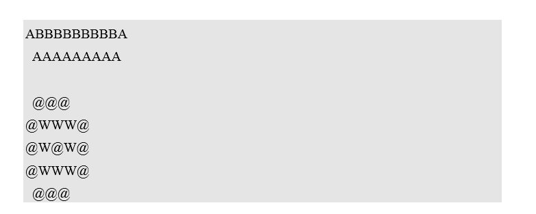

### 排版题

**例题1**
输入一个整数h，输出一个高度为h，高为h，上底边为h的梯形，右对其，每排相差2个星号

```
#include<stdio.h>
int main(){
	int h;
	while(scanf("%d",&h)!=EOF){
		int maxLine=h+(h-1)*2;//计算最后一行包含的星号个数
		for(int i=1;i<=h;i++){
			for(int j=0;j<maxLine;j++){
				if(j<maxLine-h-(i-1)*2){
					printf(" ");
				}else{
					printf("*");
				}
			}
			printf("\n");
		} 
		
	}
	return 0;
} 
```

该排版题有一个显著的特点：首先图形具有较强的规律性，且该规律顺序往 往与输出顺序一致，即可以从上至下、从左至右应用规律。于是，我们只需仔细 观察图形，把握其中所具有的规律，并将其量化后直接写入程序的输出部分，就 可以输出题面所要求的图形。 

**例题2**




```
#include<stdio.h>
int main(){
	int outPutBuf[82][82];//用于预排版的输出缓存
	char a,b;//输出两个字符
	int n;//叠框大小
	bool firstCase=true;//是否为第一组数据标志，初始值为true
	while(scanf("%d %c %c",&n,&a,&b)==3){
		
		if(firstCase==true){
			firstCase=false;
		}else{
			printf("\n");
		}
		for(int i=1,j=1;i<=n;i+=2,j++){
			int x=n/2+1,y=x;//从里到外输出每一个圈
			x-=j-1;
			y-=j-1;//计算每个圈左上角点的坐标
			char c= (j%2==1)?a:b;//计算当前圈应该使用哪个字符
			for(int k=1;k<=i;k++){//对当前圈进行赋值 
				outPutBuf[x+k-1][y]=c;//左边赋值
				outPutBuf[x][y+k-1]=c;//上边赋值
				outPutBuf[x+i-1][y+k-1]=c;//右边赋值
				outPutBuf[x+k-1][y+i-1]=c;//下边赋值
				 
			} 
		}
		if(n!=1){//注意当n为1时不需此步骤 
			outPutBuf[1][1] =' ';
			outPutBuf[1][n] =' ';
			outPutBuf[n][1] =' ';
			outPutBuf[n][n] =' ';//将四角置为空格 
		}
		for(int i=1;i<=n;i++){
			for(int j=1;j<=n;j++){
				printf("%c",outPutBuf[i][j]);
			}
			printf("\n");
		} 
	} 
	return 0;
}
```

**一定要注意输入问题~~~ scanf去控制空格以免赋值错误**

我们对该字符阵列坐标做如下规定，规定阵列左上角坐标为（1，1），阵列右下角为（n，n），其他坐标由此退出。
程序按照由最内圈到最外圈的顺序来完成图形的排列。在完成每圈的排列时，需要注意以下两个要点;首先确定该圈的左上角坐标，然后以此为参照点来完成盖全的其他字符位置。观察可知，
最中间圈的左上角字符坐标为（n/2+1，n/2+1），次中间圈的左上角坐标为（n/2+1-1，n/2+1-1，依次类推可得图形中的每个圈的参照点。

其次，计算每圈的边长，我们发现中心圈长为1，依次长度加2.

首先明确该圈使用哪一个字符来填充，我们使用判断循环次数指示变量j的奇偶 性来判断当前需要使用的字符，即奇数次循环时（j为奇数）时使用第一个字符， 偶数次循环时使用第二个字符。然后，我们确定该圈左上角字符的坐标，我们使 用中心坐标（n / 2 + 1，n / 2 + 1）减去当前循环次数指示变量j来确定该圈左上 角坐标，即（n / 2 + 1- j,n / 2 + 1 - j)。接着，我们计算该圈边长长度，我们利用 初始值为 1 的循环指示变量 i 来表示边长长度，并在每次循环结束后加 2，代表
 

 
边长由 1 开始，每外移一个圈边长长度即加上 2。利用变量 i 所存的值我们即可 对当前圈的四条边进行赋值，对应的坐标已在代码中给出，这里不再列举。在完 成所有圈的编排后，我们只需按照题目的需要去除四个角的字符，最后将整个输 出缓存中的字符阵列输出即可。


>另外，此代码还有两个注意点值得我们指出。 1.输出格式。题面要求我们在输出的每个叠筐间输出一个空行，即除了最后 一个叠筐后没有多余的空行，其它叠筐输出完成后都需要额外的输出一个空行。 为了完成这个要求，我们将要求形式改变为除了在第一个输出的叠筐前不输出一 个空行外，在其它每一个输出的叠筐前都需要输出一个额外的空行。为完成这一 目的，我们在程序开头设立了firstCase变量来表示正在处理数据的是否为第一组 数据，毫无疑问它的初始值为true。在程序读取每组数据后，我们都测试firstCase 的值，若其为true则表示当前处理的数据为第一组数据，我们不输出空行，并在 此时将 firstCase 变量改变为 false。以后，每当程序读入数据，测试 firstCase 变 量时，该变量均为 false，于是我们完成题目的要求，在输出的叠筐前额外的输 出一个空行，来达到题面对于输出格式的要求。 2.边界数据处理。按上文所说，我们在输出缓存中完成字符阵列排版后，需 要将该阵列四个角的字符修改为空格，但是这一修改不是一定需要的。当输入的 n为1时，该修改会变得多余，它会使输出仅变为一个空格，这与题面要求不符。 因此，在进行该修改之前，我们需要对n的数值作出判断，若其不为1则进行修 改，否则跳过修改部分。由此不难看出，机试考题要求我们在作答时，不仅能够 大致的把握算法，同时还要细致的考虑边界数据会给我们的程序造成什么样的影 响。只有充分考虑了所有情况，并保证在所有题面明确将会出现的条件下，程序 依旧能够正常工作，这样我们才能使自己的程序真正的万无一失、滴水不漏。 本例介绍了另一种解决排版题的思路，当输出图形所具有的规律不能或者很难直 接应用到输出上时，我们就要考虑采用该例所采用的方法，先用一个二维数组来 保存将要输出的字符阵列，并在该数组上首先完成排版。因为没有了输出时从上 至下、从左至右的顺序限制，我们能更加随意的按照自己的需要或者图形的规律 来依次输出图形，从而完成题目要求。 